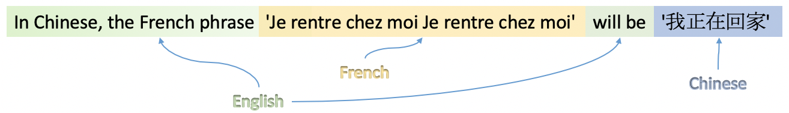

# seqtolang

[](https://img.shields.io/badge/python-3.6%20%7C%203.7-blue)
[](https://circleci.com/gh/hiredscorelabs/seqtolang)
[](https://github.com/hiredscorelabs/seqtolang/actions)


`seqtolang` is a python library for multi-langauge documents identification.



See [this](https://medium.com/hiredscore-engineering/multi-language-documents-identification-93223af83e01) post for implementation details.


# Getting Started

Install from source:

```
$ git clone https://github.com/hiredscorelabs/seqtolang
$ cd seqtolang
$ python setup.py install
```

or using PyPi:

```
$ pip install seqtolang
```

### Basic usage:

```python
from seqtolang import Detector

detector = Detector()
text = "In Chinese, the French phrase 'Je rentre chez moi Je rentre chez moi' will be '我正在回家'"
languages = detector.detect(text)
print(languages)

>>> [('fr', 0.499), ('en', 0.437), ('zh', 0.062)]


tokens = detector.detect(text, aggregated=False)
print(tokens)

>>> ['eng', 'eng', 'eng', 'eng', 'eng', 'fra', 'fra', 'fra', 'fra', 'fra', 'fra', 'fra', 'fra', 'eng', 'eng', 'zho']

```

`seqtolang` support 36 languages:
```
['afr', 'eus', 'bel', 'ben', 'bul', 'cat', 'zho', 'ces', 'dan', 'nld', 'eng', 'est', 'fin', 'fra', 
'glg', 'deu', 'ell', 'hin', 'hun', 'isl', 'ind', 'gle', 'ita', 'jpn', 'kor', 'lat', 'lit', 'pol', 
'por', 'ron', 'rus', 'slk', 'spa', 'swe', 'ukr', 'vie']

```


### Docker Example

To make it easier to test the lib a runnable docker is also provided.
To test it:

```sh
$> docker build . -t seqtolang
$> docker run -e SEQTOLANG_TEXT="Good boy in chinese is 好孩子" seqtolang
['Good', 'boy', 'in', 'chinese', 'is', '好孩子']
['eng', 'eng', 'eng', 'eng', 'eng', 'zho']
```


# Support

## Getting Help

You can ask questions and join the development discussion on [Github Issues](https://github.com/hiredscorelabs/seqtolang/issues)


## License

Apache License 2.0

